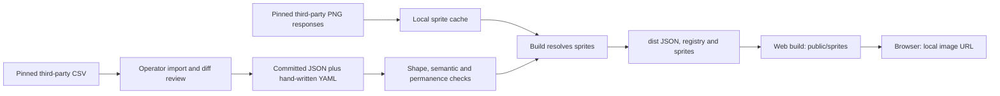
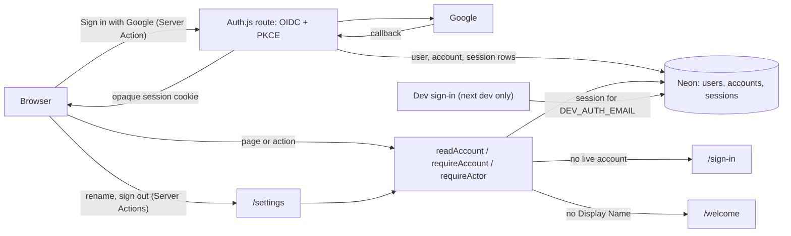
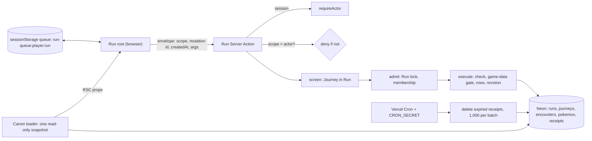
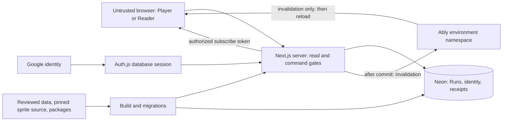

# nuzlocke.gg version 1 — threat model

## 1. Overview

**Status: milestones 1 and 2 and the Run boundary of milestone 3 implemented, remaining version 1 design, 9 October 2026.** The game-data importer, compiler, reader, sprite downloader, and web sprite components exist (milestone 1). Google sign-in, database sessions, the `users`/`accounts`/`sessions` tables, the actor gate, the Display Name step, and deploy-time migrations exist (milestone 2, NUZ-48), with Settings (rename, theme, sign out) and a local-only dev sign-in (NUZ-49). A solo Run, its tracking screen, Record an Encounter, the headcanon receipts, the persisted browser queue, recovery notices, and the daily receipt cleanup exist (milestone 3, NUZ-50 to NUZ-52). Their controls below are backed by source inspection and tests. Soul Link membership, the Reader, live access, and the other Run changes remain planned requirements. Attack stories are hypotheses for implementation review, not vulnerability findings.

The home page now requires a named, live Player (`apps/web/app/page.tsx:3-4`). The app depends on Auth.js, Drizzle, the Neon driver, and headcanon 0.4.0, but not yet on Ably (`apps/web/package.json`). Auth.js, adapter, and headcanon internals were inspected where cited below. The deployed Google client, the Neon project settings, and Vercel promotion were not tested.

The local version 1 spec takes precedence over earlier tickets and ADRs (`docs/spec/version-1/README.md:18`). Evidence below uses these short names:

| Name | Inspected source and purpose |
| --- | --- |
| P | `docs/spec/version-1/product.md`: actors, permissions, lifecycle, privacy |
| T | `docs/spec/version-1/technical-design.md`: planned components, transactions, delivery, live access |
| S | `docs/spec/version-1/screens.md`: intended screen disclosure |
| V | `docs/spec/version-1/testing.md`: required verification |
| Glossary | `apps/web/CONTEXT.md`: domain terms |

Citations such as **T:147** mean repository-relative `docs/spec/version-1/technical-design.md:147`. The external tickets, prototypes, headcanon checkout, and hosted design document were not inspected. Source code establishes implemented behavior; the local specification remains the authority for planned product behavior. The security-policy resolver returned no applicable SECURITY.md content at the repository root.

### Implemented milestone: third-party data

There are two distinct network workflows. Neither is a public request handler:

1. **Manual CSV import.** An operator selects a Map. The script fetches 16 named CSV tables from `https://raw.githubusercontent.com/PokeAPI/pokeapi/2fe95532d27a9bf340575253aff50868319d8182/data/v2/csv/<file>.csv`, parses them, and writes only `pokeapi.wild.json` and `pokeapi.species.json` under that Map's `generated/` directory. Each fetch has a 60-second deadline. Review and commit the generated output before release (`packages/game-data/importers/pokeapi.ts:18-38`, `packages/game-data/scripts/import-pokeapi.ts:18-64`).
2. **Build-time sprites.** A build compiles committed JSON and YAML, validates identifiers and references, checks release locks, then resolves sprites. Missing cached sprites are fetched from `https://raw.githubusercontent.com/PokeAPI/sprites/35fdbe9bdec8f519f882c3edc3c0185f08af4d86/sprites/pokemon/<file>.png`. The downloader limits concurrency to 16, attempts to three, and each attempt to 30 seconds (`packages/game-data/scripts/compile.ts:18-30`, `packages/game-data/src/build.ts:53-137`, `packages/game-data/src/pokeapi-sprites.ts:11-88`).

The current source Map is Emerald. The compiler writes JSON and a generated TypeScript registry. Its static imports and JSON-escaped values avoid treating imported names as source code. The reader selects only an own property of that registry; a browser Map id is not an arbitrary file path (`packages/game-data/src/build.ts:136-217`, `packages/game-data/src/reader.ts:112-138`).

The web copy step publishes the built sprites locally. `Sprite` supplies only a local URL, fallback URL, and label to the client image component. It does not pass an upstream URL or the Map to that component. These components exist but are not yet used by any page (`apps/web/scripts/copy-sprites.ts:9-25`, `apps/web/components/sprite.tsx:40-51`, `apps/web/components/sprite-image.tsx:47-76`). The design's “no runtime data-source call” remains accurate; it must not be read as “builds never use the network.” T:18 now explicitly exempts sprites.

### Implemented resource boundaries

Paths below are repository-relative. Build paths resolve from script/module locations, not the process working directory. No provider credentials are sent explicitly by either data-fetch script. Trust in HTTPS/GitHub delivery and build storage remains necessary; a pinned URL is not a verified content digest.

| Deployment or workflow | Resource or capability | Configuration and precedence | Safe effective value or location | Readers, writers, or recipients | Enforcing control | Evidence or unknowns |
| --- | --- | --- | --- | --- | --- | --- |
| Manual import | Fetch CSV; replace generated source | Hard-coded repository, commit and file list; operator Map argument chooses local destination | `packages/game-data/sources/maps/<map>/generated/pokeapi.{wild,species}.json` | Import operator, reviewer, later compiler | Fixed network base; timeout; importer rejects unsupported data cases | `packages/game-data/scripts/import-pokeapi.ts:18-64`, `packages/game-data/importers/pokeapi.ts:18-38`; response size and record length are not capped in the script |
| Build or lock command | Read sources and release locks; create distributable files | Script sets sources, dist, released; `--frozen` versus `--lock` | `packages/game-data/dist/{<map>.json,registry.ts,sprites/**}`; locks at `packages/game-data/released/<map>.lock.json` | Local build and CI; app build consumes output | All collected validation problems stop output; frozen mode does not write locks | `packages/game-data/scripts/compile.ts:11-30`, `packages/game-data/src/build.ts:53-177`; output replacement is not transactional across filesystem failures |
| Sprite fetch/cache | Reuse external bytes and remembered 404s | Cache hit first, then `.missing`, then pinned URL | `packages/game-data/node_modules/.cache/pokeapi-sprites/<SPRITES_PIN>/<file>.png` or `.png.missing` | Build process; any actor able to write that cache | Atomic temporary-file rename; retry/deadline/concurrency bounds | `packages/game-data/src/pokeapi-sprites.ts:44-116`; no hash, PNG decode or byte limit before caching/copying |
| Root build/dev/test and CI | Schedule compiler; restore build artifacts | Workspace dependency; Turbo task dependencies and declared outputs | Package `dist/**`; web `public/sprites/**` and Next output | Build task runner and downstream tasks | Frozen compiler is a build prerequisite for package tests/typecheck and web dev/tests | `packages/game-data/turbo.json:5-14`, `apps/web/turbo.json:5-12`, `turbo.json:5-8`, `.github/workflows/ci.yml:18-24`; no remote cache deployment or cache-writer policy verified |
| Web dev/build | Replace published sprite tree | `spritesDir` resolves package output; copy script resolves app destination | `packages/game-data/dist/sprites` → `apps/web/public/sprites` → `/sprites/<species>/<form>.png` | Build writes; public browsers read | Fixed copy roots; app `Sprite` uses reader-validated form URLs | `packages/game-data/src/sprites-dir.ts:9-11`, `apps/web/scripts/copy-sprites.ts:9-25`, `apps/web/package.json:7-8`; direct `next build` bypasses copy orchestration |
| Browser images | Display public third-party bytes | Valid known Form URL, otherwise local unknown image | `/sprites/unknown.png` fallback; `public, max-age=604800` | Any browser; public HTTP caches | Image-element rendering; unknown Form yields no arbitrary URL | `packages/game-data/src/reader.ts:52-73`, `apps/web/components/sprite-image.tsx:61-76`, `apps/web/next.config.ts:8-17`; one week of stale sprites is intentional |

### Implemented milestone: sign-in and players

A visitor signs in with Google through Auth.js. The Google provider is OpenID Connect with PKCE (Auth.js defaults); Auth.js keeps a database session and sets an opaque `httpOnly`, `SameSite=Lax` session cookie, `Secure` on https, that expires after 30 idle days. The provider maps the Google profile to the given name only, with no picture, and stores no Google tokens (`apps/web/lib/auth.ts:13-46`). Sign-in and the callback run in Auth.js's own route handler (`apps/web/app/api/auth/[...nextauth]/route.ts`); its post-sign-in redirect accepts only same-origin URLs, and the app always passes `/`. Outside production builds, the route rebuilds the request URL from `X-Forwarded-Host`, as Auth.js's Server Actions already do, so sign-in through a local HTTPS proxy such as `tailscale serve` stays on the proxy's origin; a production build uses the URL Vercel gives it (`apps/web/app/api/auth/[...nextauth]/route.ts`). Sign out is a Server Action in Settings that calls Auth.js `signOut`, which deletes the session row and the cookie, then goes to `/sign-in` (`apps/web/app/settings/actions.ts:39-41`, `apps/web/lib/auth.ts:63-70`).

Every page and Server Action derives its actor from the session through one gate. `readAccount` returns the session's user unless the row is missing or tombstoned; `requireAccount` redirects to `/sign-in` without one; `requirePlayer` (the account, for a page that shows it) and `requireActor` (its id) also redirect to `/welcome` while the Player has no Display Name, so no screen or write skips the name step (`apps/web/lib/actor.ts:26-90`). Only the name step's action uses `requireAccount`. The sign-in page sends only a live account home, so a tombstone with a surviving session does not loop (`apps/web/app/sign-in/page.tsx:20`).

The Display Name is trimmed and limited to 1 to 30 code points on the screen, again in the Server Action, and by a database CHECK (`apps/web/lib/display-name.ts:22-31`, `apps/web/app/welcome/actions.ts:17-27`, `apps/web/app/settings/actions.ts:22-36`, `apps/web/lib/db/schema.ts:40-47`). The rename in Settings is an account action: it takes the actor from `requireActor`, takes no Run lock, and sends no signal. The update names only the actor's own live row (`apps/web/lib/players.ts:11-19`). React renders the name as text.

Settings shows the Google email only to its own Player: the page reads it from the actor's account, and no other screen or response carries it (`apps/web/app/settings/page.tsx`). The theme is a next-themes value in the browser's `localStorage`, not a column.

**Dev sign-in** lets an agent or a script sign in on a developer machine without Google: the "Dev sign in" button on `/sign-in` (a Server Action) and `POST /api/dev/sign-in` start a database session for the account with the email in `DEV_AUTH_EMAIL`, made on first use, and `POST /api/dev/sign-out` ends its sessions (`apps/web/lib/dev-auth.ts`, `apps/web/app/sign-in/dev-sign-in-button.tsx`, `apps/web/app/api/dev/`). It is off in a production build (every Vercel deployment), without `DEV_AUTH_EMAIL`, when the Host header is not localhost, and for an account linked to Google. The Host header is the client's word and `next dev` listens on every interface, so the last guard is the one that holds against another machine on the network: the most dev sign-in gives is a session as a throwaway dev Player. Unit and Postgres tests cover each guard (`apps/web/lib/dev-auth.test.ts`, `apps/web/lib/dev-auth.db.test.ts`).

| Deployment or workflow | Resource or capability | Configuration and precedence | Safe effective value or location | Readers, writers, or recipients | Enforcing control | Evidence or unknowns |
| --- | --- | --- | --- | --- | --- | --- |
| Production and preview app | Identity rows and sessions | `DATABASE_URL` from the Neon integration; one Drizzle client over the WebSocket `Pool`, 2-second connect timeout | `users`, `accounts`, `sessions`; cascades from `users` | Server only; the browser holds an opaque session token | Actor gate on every page and action; tombstone and Display Name CHECKs; partial unique email index | `apps/web/lib/db/index.ts`, `apps/web/lib/db/schema.ts:18-91`, `apps/web/drizzle/0000_users_and_sessions.sql`; database role grants not reviewed |
| Google sign-in | Prove a Google identity | `AUTH_SECRET`, `AUTH_GOOGLE_ID`, `AUTH_GOOGLE_SECRET` on Vercel; `AUTH_REDIRECT_PROXY_URL` on Production and Preview | Given name and email stored; no picture, surname, or tokens; Google registers only the `nuzlocke.gg` and `localhost:3000` callbacks | Auth.js route handler | OIDC PKCE; signed `state` carries a preview's origin through the production proxy; same-origin redirect; Auth.js CSRF token on its POST routes | `apps/web/lib/auth.ts:13-46`, `apps/web/.env.example`; Production and Preview share `AUTH_SECRET` and the Google client secret |
| Release | Migrate before promotion | `apps/web/vercel.json` build command runs `scripts/migrate.ts`, then the Turbo build | Committed SQL in `apps/web/drizzle/`; `DATABASE_URL_UNPOOLED` preferred | Vercel build | A failed migration fails the build, so the deployment is not promoted; the log names the migrated host | `apps/web/vercel.json`, `apps/web/scripts/migrate.ts`; previews get a `preview/<git-branch>` Neon branch, deleted on PR close by `.github/workflows/neon.yml` |
| Local development | Dev sign-in | `DEV_AUTH_EMAIL` in `apps/web/.env.local` or the `web` launch configuration; never on Vercel | One account, made on first use; refused when it is linked to Google | Any process that reaches the dev server with a localhost Host header | Off when `NODE_ENV` is `production`, without `DEV_AUTH_EMAIL`, on another host, or for a Google-linked account; answers 404 when off | `apps/web/lib/dev-auth.ts`, `apps/web/app/api/dev/`; the Host check alone does not stop a machine on the same network |
| Local tests | Test database | `compose.test.yaml` on localhost ports 54329 and 54330; `DATABASE_WS_PROXY` points the driver at wsproxy over plain WebSocket | Throwaway `nuzlocke_test` database | Vitest and Playwright on a developer machine or CI | Fixed local credentials only; session seeding lives in `e2e/` and never in the app | `apps/web/compose.test.yaml`, `apps/web/lib/db/neon-config.ts:12-20`, `apps/web/e2e/players.ts`; `DATABASE_WS_PROXY` must never be set on Vercel |

### Implemented milestone: the Run boundary

A Player makes a solo Run with "Make the run", a headcanon operation (`apps/web/app/runs/actions.ts:26`); the server makes the Run id, and the browser's mutation id is only an idempotency key. Every change to a Run is a `run.v1` mutation through one Server Action (`apps/web/app/runs/actions.ts:14`). The action parses the envelope strictly, derives the actor from the session (`requireActor`), and **denies an envelope whose receipt scope is not the actor's** before any receipt lookup or command (headcanon 0.4.0, `next/server/action.js`). Then `screen` checks the actor's Journey outside the transaction, which also guards replay of stored receipts; `admit` takes the Run lock (`SELECT … FOR UPDATE`) and rereads membership and the Run; `execute` runs the shared `check`, the server-only game-data gate, and explicit row writes with a revision bump (`apps/web/lib/runs/commands/record-encounter.ts:43-110`). Receipts are scoped to the Player id, with two attempts at most and headcanon's default delivery window: 7 days, 1 hour of clock skew (`apps/web/lib/runs/binder.ts:13-17`).

The canon loader reads membership, the Run, and its children in one `REPEATABLE READ READ ONLY` snapshot and returns nothing for a non-member, an unknown id, or a signed-out visitor alike (`apps/web/lib/runs/canon.ts:34-67`). It reads stored enum values leniently: a value this build does not know (a newer build wrote it, then a rollback) reads as null and renders as unknown; a null Run state admits no change, and no command writes a read value back (`apps/web/lib/runs/canon.ts:114-143`, `apps/web/lib/runs/state.ts:35-40`).

In the browser, one predicted root per Run is keyed by the viewer and the Run (`apps/web/app/runs/[runId]/run-root.tsx`). Each envelope carries the viewer's id as its scope (line 40), and the queue of unconfirmed changes is kept in `sessionStorage` under `run-queue:<playerId>:<runId>` (line 47) and delivered again under its original mutation id after a reload or a return to the Run. A stored envelope that does not parse (including one with no scope, from headcanon 0.3.0) is dropped. Next's `experimental.useOffline` resends a Server Action whose request failed with a network error once the connection returns, with the cookie of that moment; the scope check makes such a resend after a change of Player a denial instead of a write to the next Player's Journey. A change that does not save gives a toast that says what happened and never who did it; an old tab whose action id the server does not know gets "Your app is out of date. Refresh?"; a change whose outcome is unknown gets "Not saved yet" with Retry; a `beforeunload` prompt guards unsent changes and open drafts. Readers of a Refusal are lenient: an unknown kind gives a generic toast.

Vercel Cron calls `GET /api/cron/delete-expired-receipts` daily. The handler answers 401 unless `Authorization` is `Bearer $CRON_SECRET` (and when the secret is unset), then deletes expired receipts in batches of 1,000 until a batch is not full (`apps/web/app/api/cron/delete-expired-receipts/route.ts`, `apps/web/vercel.json`). After cleanup, a resend of a change older than the window gets `delivery-expired`, which the toast words as "could not be confirmed", never as lost.

| Deployment or workflow | Resource or capability | Configuration and precedence | Safe effective value or location | Readers, writers, or recipients | Enforcing control | Evidence or unknowns |
| --- | --- | --- | --- | --- | --- | --- |
| Production and preview app | Run rows | Same Drizzle client as identity | `runs`, `journeys`, `encounters`, `pokemon` (`evolutions`, `custom_places` to come) | Server only; the browser gets the viewer's canon | Actor gate, scope check, membership screen, Run lock, composite keys | `apps/web/lib/db/schema.ts`, `apps/web/lib/runs/commands/record-encounter.ts:43-110`; Postgres tests in `apps/web/lib/runs/commands/record-encounter.db.test.ts` |
| Command delivery | Receipts and retry | Receipt scope is the Player id; envelope scope must equal it; 2 attempts | `headcanon_mutation_receipts`; 7-day delivery age, 1-hour skew tolerance | headcanon authority; cleanup handler | Scope denial before receipt lookup; screen before replay; same envelope commits once | `apps/web/lib/runs/binder.ts:13-17`; the test "an envelope made for another Player of the Run is denied and writes nothing" |
| Browser recovery | Unconfirmed changes | Root keyed by viewer and Run; queue key includes both | `sessionStorage` `run-queue:<playerId>:<runId>`; memory when storage fails | Same-origin code in that tab | Server reauthorizes each delivery; a mismatched scope is denied; invalid stored envelopes dropped | `apps/web/app/runs/[runId]/run-root.tsx:36-59`, `apps/web/e2e/recovery.spec.ts`; key separation is not encryption, and a closed tab loses unsent changes |
| Daily cleanup | Delete expired receipts | Vercel Cron `0 9 * * *`; `CRON_SECRET` env | Batches of 1,000, repeated while full | Vercel Cron only | Bearer secret compared on every call; 401 otherwise | `apps/web/app/api/cron/delete-expired-receipts/route.ts`, its unit test; the loop has no total cap; the secret comparison is not constant-time |

### Intended architecture

Players sign in with Google and manually track Runs. A Run is solo or a Soul Link of two or three Players. A Reader can view a Run made readable by link without signing in. There is no public listing (P:267-274, P:304-311).

| Component | Planned role | Evidence |
| --- | --- | --- |
| Next.js app on Vercel | Pages, server actions, account actions, token and cron handlers | T:9-12, T:45-47, T:153 |
| Auth.js and Google | Database sessions; server-derived Player identity (implemented, see above) | T:9, T:72-84, T:147 |
| headcanon | Command admission, receipts, optimistic state and retry queues | T:140-153 |
| Neon Postgres through Drizzle Pool | Accounts, Runs, Journeys, child records, receipts; transactional authority | T:77-128 |
| Ably | Subscribe-only invalidations; clients refresh authoritative state | T:149 |
| Compiled game data and sprites | Implemented release pipeline described above; no runtime external game-data source | T:16-29; `packages/game-data/scripts/compile.ts:21-30` |

For a write: browser args → session-derived actor → membership screen → locked Run and admission → state/domain checks and server game-data gate → explicit row writes and revision → commit → invalidation. For a read: server access decision → consistent Run snapshot → audience-specific response. Optimistic browser state is not authority (T:141-149).

### Effective resources and capabilities

The following resources describe the remaining application design. The implemented game-data resources are listed separately above. Actual service hosts, secrets, environment precedence, and deployed permissions remain unverified.

| Deployment or workflow | Resource or capability | Configuration and precedence | Safe effective value or location | Readers, writers, or recipients | Enforcing control | Evidence or unknowns |
| --- | --- | --- | --- | --- | --- | --- |
| Production app | Persistent Run data | Neon WebSocket Pool, Drizzle (implemented for identity, Runs, and receipts) | Remaining child tables and the outside-protocol writers to come | Server and migration operator; browser only through app | Session gates, Run locks, SQL constraints | T:9, T:77-128; database role grants unspecified |
| Production live | Receive invalidations | Parsed Run axes; authorize all requested axes | `run/<runId>` within production namespace; 10-minute token | Members or Readers of link-readable Runs | Subscribe-only capability, canonical server-built axes | T:140, T:149; exact namespace and key storage unspecified |
| Preview live and data | Branch isolation | One Ably namespace per environment; each preview tied to its Neon branch | Branch-specific database and namespace; IDs may equal production IDs | Preview app and its authorized clients/operators | Environment mapping plus token gate | T:149; copied-row privacy and preview access controls unspecified |
| Invite onboarding | Join a waiting Soul Link | Separate stored invite token, remembered across sign-in | `runs.invite_token` and browser cookie | Token holder may join after sign-in; members may copy | Waiting state, capacity, one Journey/account; token ends at Start | P:268; T:70, T:92-99; entropy/cookie flags unspecified |
| Public read and preview | Read published Run fields | Current Run visibility; Reader loader reads no session | Ordinary URL with server UUID v4; public preview name/Game/Progress | Anyone with link; preview fetchers | Server visibility gate; public projection | P:306-311; T:149; cache policy unspecified |
| Release | Publish assets and migrate shared database | npm headcanon release; pinned sprite commit; committed migrations before promotion | Compiled `dist/<map>.json`, served sprites; existing database | Build/release operator; public assets to browsers | Compile validation, frozen identifier lock; backward-compatible migrations | T:16-29, T:77, T:152; CI secrets and approval controls unspecified |

## 2. Threat Model, Trust Boundaries, and Assumptions

### Protected assets and objectives

- **Implemented data and release assets:** protect generated Map facts, permanent identifiers, sprite bytes, the build worker's resources, and published output. Generated source, local download caches, and task artifacts are separate trust surfaces. Format validity does not establish game accuracy or byte authenticity (`packages/game-data/src/sources.ts:158-215`, `packages/game-data/src/permanence.ts:41-98`, `packages/game-data/src/pokeapi-sprites.ts:70-83`).
- **Account identity and private identity fields:** sessions, OAuth account linkage, Google id, email, and given name. The picture, the surname, and Google's tokens are never stored (`apps/web/lib/auth.ts:13-34`). Email is visible only to its own Player. Public identity is Display Name; deletion removes identifying account fields and sessions (P:298-302; T:72-84).
- **Run privacy:** private Runs, membership, child records, and private Attempt details must not leak through alternate routes, metadata, serialized page data, previews, receipts, or realtime access. Link-readable content is intentionally disclosed (P:306-311).
- **Write ownership and integrity:** only a Player's own Journey can be changed by that Player. Run-wide permissions are shared by all Players. Records, revisions, receipts, and Chain transitions must remain coherent (P:269; T:61, T:127-148).
- **Join authority:** an invite grants a new Journey and therefore shared Run powers. It must not be exposed as part of Reader data (P:268-269, P:308-309).
- **Service availability and cost:** Postgres connections, locks, full-Run reads, token issuance, Ably traffic, Vercel executions, and receipt storage must remain bounded. Timeouts are specified; application-wide quotas are not (T:142, T:148-153).
- **Release and environment integrity:** private production data and service credentials must not become public assets or reach unauthorized preview users (T:16-29, T:149, T:152).

### Actors and starting capabilities

1. **Anonymous visitor or Reader:** controls URLs, request args, requested axes, request frequency, and their browser state. With a readable Run URL, may see its Reader projection and subscribe to its invalidations. Cannot mutate, inspect account email, or obtain its invite.
2. **Signed-in outsider:** has a valid session for their own account and can create Runs; cannot read private unrelated Runs or write a Run merely because it is readable.
3. **Soul Link Player:** can edit their own Journey and all shared Run settings permitted by state, including visibility and lifecycle. Cannot edit a partner's Journey. A malicious partner already has the shared powers by design.
4. **Invite holder:** has a bearer capability to join while the Run waits and has capacity. No creator approval is specified. A deliberately shared invite or leaked valid invite grants the same authority.
5. **Former/deleted Player or stale browser:** may retain IDs, queued args, prior page data, and old live tokens. Current server authorization still governs requests.
6. **External website:** can attempt to induce signed-in browser requests or abuse sign-in return state. It has no legitimate session-reading authority.
7. **Build/release operator and providers:** privileged trusted actors for their intended functions. No assumption that an ordinary attacker already owns their credentials. Compromise through a concrete dependency or secret leak is a conditional path, not an established capability.
8. **Third-party data or cache attacker:** may supply hostile bytes only if they can affect the selected upstream revision/delivery, a newly approved pin, or a cache/artifact consumed by a build. Changing today's upstream branch does not change the pinned URL. A contributor can propose data changes, but acceptance and release require repository authority. A public visitor cannot currently select fetch URLs, CLI Map arguments, filesystem roots, or sprite overrides.

### Implemented data controls and limits

- **Source validation:** JSON/YAML are parsed as data and checked with strict object schemas. The compiler checks identifier grammar, duplicates, references, correction expectations, one-time versus imported methods, and play order. Species and Form identifiers cannot contain path separators; sprite override filenames allow only lowercase ASCII letters, digits and hyphens. These checks run before normal build output (`packages/game-data/src/sources.ts:27-215`, `packages/game-data/src/format.ts:12-15`, `packages/game-data/src/compile.ts:47-66`, `packages/game-data/src/compile.ts:282-308`).
- **Permanence is narrower than authenticity:** locks preserve identifiers and Species dex numbers, and frozen builds reject additions not recorded in an existing lock. A Map with no lock is allowed. Locks do not freeze names, types, encounter tables or sprite bytes. Source `pin` fields are strings, not cryptographic attestations (`packages/game-data/src/permanence.ts:41-98`, `packages/game-data/src/sources.ts:139-163`).
- **Cache is trusted input:** a cached PNG is returned without revalidation; a remembered 404 can force a fallback or fail a required sprite. The downloader writes cache files atomically, but this protects incomplete writes, not malicious bytes. A separate test checks PNG signatures and 96 × 96 header dimensions for Map sprites; it is not a full image decoder or build-time authenticity gate (`packages/game-data/src/pokeapi-sprites.ts:70-102`, `packages/game-data/test/sprites.test.ts:13-43`).
- **Helper authority stays local:** `buildMaps` accepts directory roots and deletes old output JSON/sprites; the importer accepts an operator Map directory. These are trusted caller obligations, not remote APIs. Do not expose those helpers directly to user-selected paths. `SpriteImage` similarly accepts generic URLs, while its current `Sprite` caller supplies local validated paths (`packages/game-data/src/build.ts:25-46`, `packages/game-data/src/build.ts:140-168`, `packages/game-data/scripts/import-pokeapi.ts:20-44`, `apps/web/components/sprite.tsx:40-48`).
- **Failures are not all-or-nothing publication:** semantic/sprite resolution failure precedes output writes, but a disk failure during replacement can leave partial output; the web copy removes its destination before copying. Build failure must prevent promotion, and development/release jobs must not share writable output trees with untrusted work (`packages/game-data/src/build.ts:118-168`, `apps/web/scripts/copy-sprites.ts:15-25`).

### Boundaries and required invariants

| Boundary | Invariant and specified controls | Review limit |
| --- | --- | --- |
| Browser → session/account actions | Actor comes from Auth.js, not submitted Player id; tombstoned actor denied; a Player with no Display Name is not an actor; deletion affects only caller | Implemented in `apps/web/lib/actor.ts:26-90` and tested against Postgres, with the Settings rename refusing a tombstoned or unnamed actor (`apps/web/app/settings/actions.db.test.ts`); Server Actions rely on Next's origin check and Auth.js routes on its CSRF token; delete account is not built yet |
| Browser → Journey writes | Check membership before receipt replay and ownership again under Run lock; resolve all supplied child IDs within that Run/Journey | Implemented for Record an Encounter, which takes the Journey from the actor (`apps/web/lib/runs/commands/record-encounter.ts:43-110`); later changes naming child ids must resolve them in the locked state; relational constraints do not replace authorization |
| Member → shared Run lifecycle | State transitions and all writers use Run lock; shared powers are intentional | T:43-45, T:128, T:141; outside-protocol actions need equivalent gates |
| Server → Reader | Read visibility is separate from write membership; public data must omit identity secrets and invite token in every response | P:306-311; T:148-149; no public projection schema specified |
| Invite → membership | Join validates current waiting state, token, capacity, actor, and Game under lock; Start invalidates invite | P:268; T:45, T:128; no expiry or rotation by design |
| Browser → Ably capability | Reject entire mixed unauthorized axis request; server constructs channel axes; subscribe-only, 10-minute TTL | T:149; public readability never permits publish |
| Server → database | Consistent snapshot includes revision; mutation and revision commit together; announce after commit | T:127-148; authorization reads must cover the snapshot being disclosed |
| Browser queue → retry authority | Bind delivery to the actor who made the change and to the Run; same envelope commits once; expired uncertain delivery is not claimed to have failed | Implemented: envelope scope denied unless it is the actor's, membership screen, receipts per Player, "could not be confirmed" wording (`apps/web/app/runs/[runId]/change-notice.ts`); sessionStorage may be edited by its own browser, which gains nothing the session does not already allow |
| Account deletion → shared records | Atomic tombstone and session removal, ordered Run locks, preserve other Players' Soul Link history | T:72-73; P:302; specified create/join race may leave a stray row |
| Preview/build → production | Distinct namespaces and database branches; reviewed release inputs; old/new app versions remain compatible | T:16-29, T:149, T:152; branch isolation does not anonymize copied data |

### Assumptions, accepted behavior, and open decisions

**Milestone decisions to resolve:** choose whether to verify expected sprite hashes and validate PNG structure/size in the downloader, including cache hits; bound downloaded bytes and CSV record/input sizes; establish who may write local or restored build caches; and define how pin updates and generated-source diffs are approved. Confirm production promotion uses the tested artifact or repeats the same gates. No credential exposure or exploitable image parser defect is established by the absence of those checks.

**Accepted by the spec:** any Player may publish or archive a shared Run; Archive is not access revocation. Display Names are nonunique Unicode text, not identity proof. Shared fate is a Warning, not permission to mutate a partner's Pokémon. History is editable game history, not an audit log. A same-Player stale Undo may undo a newer death. Closing a tab can lose pending changes. Account deletion can race with create/join and leave the described stray rows (P:226, P:269-290, P:298; T:39, T:73, T:150).

**Important privacy limits:** noindex and random IDs reduce discovery but do not prevent forwarding or copying. Switching private prevents future authorized reads; it cannot erase an already downloaded page or a third-party preview. The spec says live renewal is refused after visibility changes, but an issued token can last until its 10-minute expiry. Model the intervening invalidation timing/revision exposure separately from full data access (P:306-311; T:149).

**Decisions needed before the relevant feature ships:**

1. Define exactly which fields, row details, and summary aggregates a Reader sees for a **private earlier Attempt**. “Not a link” does not settle whether causes, dates, Progress, or Chain aggregates may disclose private data (P:294, P:309).
2. Define authorization and cache behavior for every page data response, preview image, metadata response, and direct child URL after a visibility change. The uncached canon loader alone does not specify these other layers (T:148; P:311).
3. Choose invite entropy, storage/log redaction, sign-in cookie lifetime/flags, safe same-origin return targets, and the signed-out join screen's permitted metadata. Do not silently add invite rotation or expiry against P:268 (T:70; S:60-62).
4. Sign-in uses Auth.js's OIDC PKCE and same-origin redirect defaults (milestone 2). Still verify session invalidation on delete account, and cross-origin protection for any custom Route Handler and the outside-protocol lifecycle actions (T:9, T:45-47, T:72).
5. Define payload/string/batch limits, per-actor/IP/Run request budgets, token axis limits, and a total work bound for the cleanup loop (its authentication is implemented with `CRON_SECRET`). Full-Run loading and an unpaginated Box make stored-data growth relevant (T:142, T:148, T:153; P:336).
6. Define preview access, whether production rows may be copied, secret scope, logs/backups retention, and deletion treatment of receipts or browser queues containing old names/text. Tombstoning account columns does not remove personal text Players typed into shared records (T:72-85, T:149-153). As provisioned on 9 October 2026, preview deployments get their own `preview/<git-branch>` Neon branch, deleted when the PR closes, but development and production still share one branch: a local `next dev` with pulled variables acts on the production database. One preview build before preview branching was on migrated the production branch (additive, empty database).
7. The offline boundary is settled for saves: the product excludes offline entry, but Next's `useOffline` resends a save made while offline once the connection returns, and the recovery suite covers it. Recovery of already-built changes is a supported untrusted-input path (P:324; T:150; V:41).
8. headcanon 0.4.0 is installed: it keeps a persisted queue in order across unmount (NUZ-41), reports `mayHaveCommitted` on `stale-client` (NUZ-42), and scopes every envelope to one actor (NUZ-66, NUZ-67). Receipt retention follows its defaults with daily cleanup.

Payments, save-file/emulator imports, arbitrary user code execution, uploads, and runtime game-data fetches are not planned surfaces. The manual CSV importer and build-time sprite fetcher are now implemented operator surfaces (P:314-340; T:16-29). No new product permissions are proposed by this model.

## 3. Attack Surface, Mitigations, and Attacker Stories

**All attack stories are hypotheses.** Priority means review order, not an assigned vulnerability severity. The first table uses source-established milestone controls. The second retains planned application scenarios; its controls are specified, not implemented.

### Implemented milestone scenarios

| Priority | Scenario and capability gain | Prerequisites | Impact | Existing controls | Mitigation | Evidence |
| --- | --- | --- | --- | --- | --- | --- |
| First | Poison sprite cache or restored artifact to publish substituted bytes | Write access to a cache/artifact consumed by a trusted build, without equivalent release authority | Defaced or malformed public assets; possible build disruption | Commit-specific cache paths, atomic cache writes, sprite header tests | Separate untrusted CI/cache writers; verify content digests on hits and downloads; validate artifacts before publication | `packages/game-data/src/pokeapi-sprites.ts:70-102`, `packages/game-data/test/sprites.test.ts:21-43`, `apps/web/scripts/copy-sprites.ts:24-25` |
| First | Malformed or oversized upstream response consumes memory or produces invalid images | Influence selected response/pin; operator import or cold sprite build runs | Import/build outage; malformed bytes reach public assets | Fixed hosts/pins, fetch deadlines, 16 concurrent sprite downloads and three attempts; CSV semantic checks | Limit response bytes and CSV record size; validate PNG structure/dimensions before caching; bound total work | `packages/game-data/scripts/import-pokeapi.ts:46-60`, `packages/game-data/src/pokeapi-sprites.ts:11-70`; no browser execution or server compromise established |
| Next | Valid-looking imported changes silently change game facts | Malicious upstream change approved in pin update, or generated diff accepted without adequate review | Wrong suggestions/types/evolution lines across consumers; future Warning changes | Strict shapes, semantic checks, correction expectations, frozen permanence locks | Review semantic source diffs and provenance; compare important facts against independent game sources | `packages/game-data/src/compile.ts:47-66`, `packages/game-data/src/permanence.ts:41-98`; ordinary wrong game facts are usually quality defects, not an authorization break |
| Next | Data-derived identifier attempts path escape or generated-code injection | Malicious imported/source identifier reaches output construction | Conditional overwrite or build-code execution if controls regress | Identifier grammar, Map-directory match, constrained sprite filenames, JSON escaping in registry | Keep all caller paths behind compile validation; test hostile identifiers at build seam; do not turn CLI helpers into public endpoints | `packages/game-data/src/build.ts:69-76`, `packages/game-data/src/build.ts:192-217`, `packages/game-data/src/compile.ts:110-140`, `packages/game-data/src/sources.ts:160-163`; no current bypass established |
| Next | Build failure leaves mixed/stale artifacts that are then published | Filesystem/copy failure plus promotion ignoring failure or reuse of shared output | Missing/substituted assets or mismatched registry; usually availability/integrity | Errors propagate; validation precedes writes; web script checks source exists | Promote only successful isolated build output; avoid parallel writes to the same output tree | `packages/game-data/src/build.ts:118-168`, `apps/web/scripts/copy-sprites.ts:15-25` |
| First | A signed-in account without a Display Name, or a tombstone with a surviving session, acts through a page or a later Server Action | A page or action that reads the session directly instead of through the gate | Unnamed or deleted Player appears in shared Runs | `requirePlayer` and `requireActor` redirect both; tests cover each case against Postgres | Keep every page and command on `requirePlayer` or `requireActor`; only the name step uses `requireAccount` | `apps/web/lib/actor.ts:26-90`, `apps/web/lib/actor.db.test.ts`, `apps/web/app/settings/actions.db.test.ts` |
| First | Local development, or a preview whose branch URL does not reach the build, migrates or writes production identity rows | Development env shares the production Neon branch; the integration injects a preview's branch URL by webhook, and Neon's docs do not say the build sees it | Test data or a bad migration on production | Migrations are additive and committed; a failed migration stops the build; the build log names the migrated host | Give development its own Neon branch; check a preview's build log names its own branch, else migrate previews from CI after deploy | `apps/web/vercel.json`, `apps/web/scripts/migrate.ts`, `.github/workflows/neon.yml`; state as of 9 October 2026 |
| Next | `DATABASE_WS_PROXY` set on a deployment sends database traffic over plain WebSocket to another host | Write access to Vercel environment variables | Credential and data exposure to that host | Unset on Vercel; documented as local only | Keep it out of Vercel envs; an env writer already holds `DATABASE_URL` | `apps/web/lib/db/neon-config.ts:12-20`, `apps/web/.env.example` |
| Next | Code on any pushed branch reads the production Google client secret and `AUTH_SECRET` in its preview deployment | Push access to the repository | Could sign OAuth state or cookies that production accepts as its own; sessions stay opaque database tokens, so no session can be minted from the secret | Preview and Production share the secret by design of the redirect proxy; only repository writers can deploy | Keep push access to trusted writers; rotate both secrets if a branch is suspected | `apps/web/.env.example`; Auth.js redirect proxy |
| Next | Another machine on the developer's network calls dev sign-in with a spoofed localhost Host header | Network reach to a running `next dev` with `DEV_AUTH_EMAIL` set | A session as the dev Player on that dev server, and so writes to whichever database it uses; sign-out of the dev Player's sessions | Off in production builds; refused for a Google-linked account, so no real person's account is reachable | Use a dev email nobody signs in with; give development its own Neon branch; bind `next dev` to localhost on an untrusted network | `apps/web/lib/dev-auth.ts`, `apps/web/lib/dev-auth.db.test.ts` |
| Later | A Display Name with markup or control characters spoofs another Player in a list | Any Player; names are not unique by design | Confusion only; React escapes the text | Trim, 1 to 30 code points, plain-text rendering | Treat Display Names as untrusted text everywhere, including metadata and previews | `apps/web/lib/display-name.ts:22-31`; P:298 |
| First | A change held offline or queued across a sign-out is delivered with the next Player's session and lands in their Journey | Shared browser; a Run with both Players; Next's offline resend or headcanon's delivery after unmount | Wrong-Player write in a Soul Link | Envelope scope denied unless it is the actor's, before receipts or commands; queue keyed by Player and Run; scope-less stored envelopes dropped | Keep `scope` equal to the authority's receipt scope; keep the Player in the queue key | `apps/web/app/runs/[runId]/run-root.tsx:40`, `apps/web/e2e/recovery.spec.ts` ("a change held across a change of Player"), `apps/web/lib/runs/commands/record-encounter.db.test.ts` |
| Next | A Player edits their own tab's stored queue to send crafted envelopes | The Player's own browser | None beyond their own session's authority | Every delivery is parsed, scoped, screened, and admitted as a fresh request | Keep server checks independent of the browser's queue | `apps/web/lib/runs/commands/record-encounter.ts:43-110`; self-only forged predictions are not findings |
| Next | Anyone calls the cron route to force cleanup work, or a leaked `CRON_SECRET` repeats it | Network reach; the secret for any effect | Bounded database work; receipts older than the window are deleted, which they would be anyway | 401 without the bearer secret; batches of 1,000 | Keep the secret in Vercel only; add a total work cap if receipt volume grows | `apps/web/app/api/cron/delete-expired-receipts/route.ts` and its unit test |
| Later | An old tab after a deploy saves to an action the new build does not know, or reads a value a newer build stored | A tab open across a deploy or a rollback | A change that may not save, reported as "could not be confirmed"; no wrong write | headcanon settles `stale-client`; the persistent out-of-date toast; lenient enum and Refusal readers | Keep `run.v1` args optional-only and enum values add-only (ADR 0003) | `apps/web/app/runs/[runId]/change-notice.ts`, `apps/web/lib/runs/state.ts:35-40`, `apps/web/e2e/recovery.spec.ts` |
| Later | Bad pin or stale negative cache suppresses required image | Unavailable source, cached 404, or bad approved override | Failed cold build, fallback image, or stale public sprite | Required sprites fail; optional Forms fall back; local unknown image; bounded retries | Keep source availability and cache recovery procedures; review pin/override changes; preserve intentional one-week HTTP cache policy | `packages/game-data/src/sprites.ts:119-157`, `packages/game-data/src/pokeapi-sprites.ts:57-88`, `apps/web/next.config.ts:11-16` |

### Planned application scenarios

| Priority | Scenario and capability gain | Prerequisites | Impact | Existing controls | Mitigation | Evidence |
| --- | --- | --- | --- | --- | --- | --- |
| First | Outsider substitutes Run/child IDs, or partner targets another Journey, to read/change records | Missing gate in action, loader, nested lookup, or lifecycle path | Cross-Player disclosure or modification | Session actor; screen; locked admit; composite foreign keys | Test every action/read path with foreign Run and partner IDs, including batch moves and direct URLs; bind lookups to actor-authorized scope | T:61, T:104-128, T:147; V:9, V:34 |
| First | Reader extracts private fields from serialized state, preview, or a private Attempt row/aggregate | Public response reuses member state or hides links without filtering data | Email/invite disclosure; private history disclosure; invite could grant membership | Private default; public-only previews; Reader exclusions | Explicit public projection before serialization; resolve private Attempt field policy; test payloads, not just visible controls | P:294, P:306-311; T:143, T:148-149; V:40 |
| First | Old public response remains available after Run becomes private | Cached page/metadata/image ignores new visibility or audience | Continued fresh disclosure | Uncached canon loader; visibility gate; token renewal denial | Test caches and direct child routes across revocation; prohibit private fields in public cache entries; define preview retention limits | T:148-149; P:306-311 |
| First | Crafted axis request grants other Run subscriptions or publish rights; preview receives production signals | Token authorization, capability, or namespace configuration error | Activity leak, spoofed invalidations, forced refresh load | Whole-request rejection; canonical axes; subscribe-only; environment namespace | Test mixed-axis batches, publish denial, renewal after revocation, same Run IDs across branches; keep payloads minimal | T:140, T:149; V:38 |
| First | External site causes account deletion, visibility change, or session confusion | Missing origin/session/redirect protection | Account loss or unintended publication under victim authority | Auth.js database sessions; actor gate | Verify framework protections in actual bindings; constrain callback/return state; enforce origin protections on custom handlers | T:9, T:45-47, T:70-73, T:147 |
| First | Stored Player text executes in partner/Reader browser | Unsafe HTML, attribute, script, or preview interpolation | Victim-session actions and private data access | House rules explicitly plain text; Display Name length bound | Context-safe rendering for all names/causes/text; no raw HTML; parameterized SQL and strict input schemas | P:263, P:286, P:298; T:145 |
| Next | Attacker guesses or obtains invite through logs/public payload/cookie leak and joins | Valid waiting invite and free capacity | Own Journey plus shared lifecycle/visibility authority | Invite hidden from Readers; state/capacity checks; Start kills token | Strong random token; redact bearer value; validate join atomically; same-origin onboarding; document nonrotation design | P:268-269, P:308; T:70, T:92-99, T:128; S:62 |
| Next | Retry reuses another actor's receipt or changes payload under one mutation identity | Defective receipt scoping/binding in a later change or operation | Unauthorized response disclosure or mutation | Envelope scope check, user receipt scope, membership screen before replay, `mutation-id-reused` (implemented for Record an Encounter and Make the run) | Keep these tests for every new change and operation: cross-user and cross-Run replay, altered payload, session switch, deleted actor | T:147, T:150, T:153; V:34, V:41 |
| Next | Concurrent joins/Start/Try again or a writer outside protocol bypasses locked validation | Missing shared locking/state checks | Excess membership, branched Chains, invalid state or partial writes | All writers lock Run; transactional revision; unique constraints; consistent read | Exercise concurrent membership/lifecycle/account operations against real Postgres, including rollback | T:45, T:73, T:127-148; V:29, V:35-36 |
| Next | Deleted identity keeps usable session or personal data remains in another output | Incomplete tombstone/session cleanup or unreviewed retention surface | Continued access; identity retention | Atomic identifying-field nulling; session/OAuth deletion; tombstone refusal | Test session invalidation and every actor path; inventory receipt/log/backup/browser retention; preserve intended shared game history | T:72-85; P:302; V:36 |
| Next | Cheap public reads/token calls or a member's oversized Runs exhaust shared resources | No request/data/work budgets; reachable public endpoints | Cross-user outage or provider cost | DB/lock timeouts; bounded retry attempts; no timer polling | Bound args, move batches, axes, strings, stored growth and cleanup work; rate-limit costly handlers; authenticate cron | T:142, T:148-153; P:336 |
| Next | Preview exposes copied production rows or build dependency exposes credentials | Preview access/secret grants or trusted build input is compromised | Broad private-data disclosure or service write authority | Separate branch/namespace; pinned sources; compile validation | Restrict preview audience/data/secrets; least-privilege runtime and migration roles; review dependencies and immutable inputs | T:9-10, T:16-29, T:149, T:152 |
| Later | Old/new deployment or malformed stored args produce reordered/duplicate effects | Incompatible schema/protocol, or receipt failure | Usually same-Run data integrity loss; scope depends on affected actors | Additive protocol, lenient readers, receipts; the NUZ-41 ordering fix is in headcanon 0.4.0 | Test the rename ordering case with Rename a Pokémon (NUZ-55); check old-tab saves on two production builds for each release that changes the protocol | T:150-160; V:41-42 |

Existing milestone tests cover cache hits, negative caching, retries/timeouts, compiler failure, sprite selection, permanence, and reader lookup. They were inspected as evidence of intended checks, not executed for this document (`packages/game-data/test/pokeapi-sprites.test.ts:56-115`, `packages/game-data/test/build.test.ts:97-262`, `packages/game-data/test/sprites.test.ts:21-43`). The sprite-source unit tests use mocked fetches; CI can still fetch real sprites because package tests depend on build. The inspected CI workflow runs on pushes to main and pull requests, but does not itself run a full Next production build or publish a deployment. Token permissions, required checks, and release/cache-writer authorization are not established by that file (.github/workflows/ci.yml:3-24). Deployed gates and browser image-decoder behavior were not validated.

Milestone 3 verification runs the real-Postgres command/loader seam (`*.db.test.ts`), the cron handler's unit test, and the Playwright recovery suite (`apps/web/e2e/recovery.spec.ts`), which intercepts the network to lose responses, fail refreshes, rewrite action ids and envelope dates, and switch the session while a save is held offline. A negative control removed headcanon's scope check and the Player-switch test failed. Add focused assertions for unresolved privacy projections, cross-origin requests, live access, and resource limits when their designs are decided.

## 4. Severity Calibration (Critical, High, Medium, Low)

Use proven authority gain, affected audience, and reachability to rate an implemented defect. Missing source or an undecided control lowers confidence; it does not itself prove either a vulnerability or safety.

| Level | Concrete qualifying example if proven | Counterexample or limiting condition |
| --- | --- | --- |
| Critical | Unauthenticated service compromise enabling arbitrary server execution or unrestricted read/write of all accounts and Runs | Merely assuming a stolen operator credential or compromised provider is not a demonstrated application path |
| High | Reliable cross-account private-Run read/write; account takeover; Reader receives a private invite and uses it to gain shared control; stored script can act as other Players | A member changing shared visibility, or a valid invite holder joining within policy, already has that authority |
| Medium | Bounded private metadata disclosure; targeted cross-user disruption under realistic quotas; unauthorized account-state action with narrower reach | A post-revocation token carrying only minimal invalidations has less impact than a loader returning private records; quantify actual payload and duration |
| Low | Small unintended non-sensitive disclosure or limited cross-user nuisance with constrained reach | Self-only forged local predictions, ordinary Warning violations, nonunique names, and accepted self-device races need not be security findings at all |

For the implemented pipeline, a proven data-to-build-code execution path with release credentials could be High or Critical depending on authority reached. Cache poisoning that only changes pictures or blocks one operator build is much narrower; rating it requires proof that the attacker crosses a real cache-writer/release boundary. Missing hashes, malformed PNG bytes, or a provider outage alone do not establish code execution. Incorrect encounter facts, an intended first-Form fallback, and the accepted week of stale sprites are not by themselves security vulnerabilities.

Do not assign Critical simply because a third-party service or build exists. Do not assign High to normal link sharing, archival, editable game history, or an authorized partner's shared-setting changes. A leaked invite's consequence is significant, but its deliberate lack of expiry/rotation is an explicit product choice. No severity is assigned to an unverified scaffold omission.

**Review method:** Source inspection and an independent fresh-context architecture review covered the milestone 1 importer, compile, cache, reader, sprite consumers and build/CI configuration. The milestone 2 updates (NUZ-48, NUZ-49) inspected the new sign-in, gate, schema, migration, and test code and the cited Auth.js internals, then Settings and dev sign-in; their seam 1 tests (Vitest against Postgres 17) and Playwright flow were run. The milestone 3 update (NUZ-52) inspected the Run action, binder, Record an Encounter command, canon loader, Run root, cron handler, and headcanon 0.4.0's action and root, and ran the seam 1 tests and the Playwright suites. The earlier spec-based application model is retained as planned behavior.

**Provenance:** Milestone 1 at source revision `46c31079170a5a7478e0666fefb22bbc905d1afe`; milestone 2 on branch `feature/nuz-48-sign-in-with-google-and-choose-a-display-name` from `30dbc07`, and `feature/nuz-49-settings-display-name-theme-and-sign-out` from `d489129`; milestone 3 on `feature/nuz-52-recovery-toasts-the-unsaved-bar-and-the-out-of-date-bar` from `80c44d2`. Scope: `packages/game-data`, its web sprite consumers, the web app's sign-in, gate, Settings, dev sign-in, schema, and migrations, root/workspace task configuration, CI, and the version 1 spec. Generated Emerald data and the release lock are inputs, not independently fact-checked game content. This is an architecture threat model, not a completed vulnerability scan.

Repository: sha256:ec74bfc1d4ae5e66f679d8d1e0adaa09e27f3d5684d720e1cd3d34dfa8e5cda6
Version: 46c31079170a5a7478e0666fefb22bbc905d1afe
