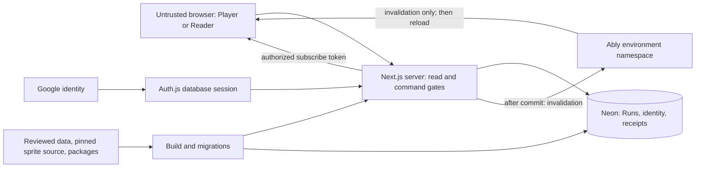

# nuzlocke.gg version 1 — spec-based threat model

## 1. Overview

**Status: design model, 8 October 2026.** This document models the planned version 1 application, as requested. Controls described as “specified” are requirements, not verified implementation. Attack stories are hypotheses for implementation review, not vulnerability findings.

The inspected app entry page is a starter screen (`apps/web/app/page.tsx:3-11`); its dependency list does not yet include the planned authentication, database, or headcanon integration (`apps/web/package.json:15-21`). No deployed service, dependency internals, or provider configuration was tested.

The local version 1 spec takes precedence over earlier tickets and ADRs (`docs/spec/version-1/README.md:18`). Evidence below uses these short names:

| Name | Inspected source and purpose |
| --- | --- |
| P | `docs/spec/version-1/product.md`: actors, permissions, lifecycle, privacy |
| T | `docs/spec/version-1/technical-design.md`: planned components, transactions, delivery, live access |
| S | `docs/spec/version-1/screens.md`: intended screen disclosure |
| V | `docs/spec/version-1/testing.md`: required verification |
| Glossary | `apps/web/CONTEXT.md`: domain terms |

Citations such as **T:147** mean repository-relative `docs/spec/version-1/technical-design.md:147`. The external tickets, prototypes, headcanon checkout, and hosted design document were not inspected. The local specification is the authority for this model. The security-policy resolver returned no applicable SECURITY.md content for the spec scope.

### Intended architecture

Players sign in with Google and manually track Runs. A Run is solo or a Soul Link of two or three Players. A Reader can view a Run made readable by link without signing in. There is no public listing (P:267-274, P:304-311).

| Component | Planned role | Evidence |
| --- | --- | --- |
| Next.js app on Vercel | Pages, server actions, account actions, token and cron handlers | T:9-12, T:45-47, T:153 |
| Auth.js and Google | Database sessions; server-derived Player identity | T:9, T:72-84, T:147 |
| headcanon | Command admission, receipts, optimistic state and retry queues | T:140-153 |
| Neon Postgres through Drizzle Pool | Accounts, Runs, Journeys, child records, receipts; transactional authority | T:77-128 |
| Ably | Subscribe-only invalidations; clients refresh authoritative state | T:149 |
| Compiled game data and sprites | Release-time assets; no runtime external game-data source | T:16-29 |

For a write: browser args → session-derived actor → membership screen → locked Run and admission → state/domain checks and server game-data gate → explicit row writes and revision → commit → invalidation. For a read: server access decision → consistent Run snapshot → audience-specific response. Optimistic browser state is not authority (T:141-149).

### Effective resources and capabilities

These are specified effective values. Actual hosts, secrets, environment precedence, and deployed permissions remain unverified.

| Deployment or workflow | Resource or capability | Configuration and precedence | Safe effective value or location | Readers, writers, or recipients | Enforcing control | Evidence or unknowns |
| --- | --- | --- | --- | --- | --- | --- |
| Production app | Persistent identity and Run data | Neon WebSocket Pool, Drizzle | Neon database; tables users/accounts/sessions/runs/journeys/children/receipts | Server and migration operator; browser only through app | Session gates, Run locks, SQL constraints | T:9, T:77-128; connection secret name and database role grants unspecified |
| Command delivery | Retry authority | Actor from session; receipt scope user id | headcanon_mutation_receipts; 7-day delivery age, 1-hour skew tolerance | Mutation authority and cleanup handler | Membership screen also guards receipt replay; locked admission | T:147, T:153; actual receipt payload binding/storage not inspected |
| Browser recovery | Pending command args | Root and storage key include Player and Run | sessionStorage key `run-queue:<playerId>:<runId>`; memory fallback | Same-origin browser code | Identity-keyed remount; server reauthorization | T:143, T:150; key separation is not encryption |
| Production live | Receive invalidations | Parsed Run axes; authorize all requested axes | `run/<runId>` within production namespace; 10-minute token | Members or Readers of link-readable Runs | Subscribe-only capability, canonical server-built axes | T:140, T:149; exact namespace and key storage unspecified |
| Preview live and data | Branch isolation | One Ably namespace per environment; each preview tied to its Neon branch | Branch-specific database and namespace; IDs may equal production IDs | Preview app and its authorized clients/operators | Environment mapping plus token gate | T:149; copied-row privacy and preview access controls unspecified |
| Invite onboarding | Join a waiting Soul Link | Separate stored invite token, remembered across sign-in | `runs.invite_token` and browser cookie | Token holder may join after sign-in; members may copy | Waiting state, capacity, one Journey/account; token ends at Start | P:268; T:70, T:92-99; entropy/cookie flags unspecified |
| Public read and preview | Read published Run fields | Current Run visibility; Reader loader reads no session | Ordinary URL with server UUID v4; public preview name/Game/Progress | Anyone with link; preview fetchers | Server visibility gate; public projection | P:306-311; T:149; cache policy unspecified |
| Daily cleanup | Delete expired receipts | Vercel Cron invoking authority | Batches of 1,000, repeat while full | Server cleanup handler | Authority's expiry rule | T:153; handler authentication and work cap unspecified |
| Release | Publish assets and migrate shared database | npm headcanon release; pinned sprite commit; committed migrations before promotion | Compiled `dist/<map>.json`, served sprites; existing database | Build/release operator; public assets to browsers | Compile validation, frozen identifier lock; backward-compatible migrations | T:16-29, T:77, T:152; CI secrets and approval controls unspecified |

## 2. Threat Model, Trust Boundaries, and Assumptions

### Protected assets and objectives

- **Account identity and private identity fields:** sessions, OAuth account linkage, Google id/email/name/image. Email is visible only to its own Player. Public identity is Display Name; deletion removes identifying account fields and sessions (P:298-302; T:72-84).
- **Run privacy:** private Runs, membership, child records, and private Attempt details must not leak through alternate routes, metadata, serialized page data, previews, receipts, or realtime access. Link-readable content is intentionally disclosed (P:306-311).
- **Write ownership and integrity:** only a Player's own Journey can be changed by that Player. Run-wide permissions are shared by all Players. Records, revisions, receipts, and Chain transitions must remain coherent (P:269; T:61, T:127-148).
- **Join authority:** an invite grants a new Journey and therefore shared Run powers. It must not be exposed as part of Reader data (P:268-269, P:308-309).
- **Service availability and cost:** Postgres connections, locks, full-Run reads, token issuance, Ably traffic, Vercel executions, and receipt storage must remain bounded. Timeouts are specified; application-wide quotas are not (T:142, T:148-153).
- **Release and environment integrity:** private production data and service credentials must not become public assets or reach unauthorized preview users (T:16-29, T:149, T:152).

### Actors and starting capabilities

1. **Anonymous visitor or Reader:** controls URLs, request args, requested axes, request frequency, and their browser state. With a readable Run URL, may see its Reader projection and subscribe to its invalidations. Cannot mutate, inspect account email, or obtain its invite.
2. **Signed-in outsider:** has a valid session for their own account and can create Runs; cannot read private unrelated Runs or write a Run merely because it is readable.
3. **Soul Link Player:** can edit their own Journey and all shared Run settings permitted by state, including visibility and lifecycle. Cannot edit a partner's Journey. A malicious partner already has the shared powers by design.
4. **Invite holder:** has a bearer capability to join while the Run waits and has capacity. No creator approval is specified. A deliberately shared invite or leaked valid invite grants the same authority.
5. **Former/deleted Player or stale browser:** may retain IDs, queued args, prior page data, and old live tokens. Current server authorization still governs requests.
6. **External website:** can attempt to induce signed-in browser requests or abuse sign-in return state. It has no legitimate session-reading authority.
7. **Build/release operator and providers:** privileged trusted actors for their intended functions. No assumption that an ordinary attacker already owns their credentials. Compromise through a concrete dependency or secret leak is a conditional path, not an established capability.

### Boundaries and required invariants

| Boundary | Invariant and specified controls | Review limit |
| --- | --- | --- |
| Browser → session/account actions | Actor comes from Auth.js, not submitted Player id; tombstoned actor denied; deletion affects only caller | T:72-73, T:147; OAuth callback, cookie and cross-origin controls still need implementation review |
| Browser → Journey writes | Check membership before receipt replay and ownership again under Run lock; resolve all supplied child IDs within that Run/Journey | T:61, T:104-127, T:147; relational constraints do not replace authorization |
| Member → shared Run lifecycle | State transitions and all writers use Run lock; shared powers are intentional | T:43-45, T:128, T:141; outside-protocol actions need equivalent gates |
| Server → Reader | Read visibility is separate from write membership; public data must omit identity secrets and invite token in every response | P:306-311; T:148-149; no public projection schema specified |
| Invite → membership | Join validates current waiting state, token, capacity, actor, and Game under lock; Start invalidates invite | P:268; T:45, T:128; no expiry or rotation by design |
| Browser → Ably capability | Reject entire mixed unauthorized axis request; server constructs channel axes; subscribe-only, 10-minute TTL | T:149; public readability never permits publish |
| Server → database | Consistent snapshot includes revision; mutation and revision commit together; announce after commit | T:127-148; authorization reads must cover the snapshot being disclosed |
| Browser queue → retry authority | Bind delivery to current actor and Run; same envelope commits once; expired uncertain delivery is not claimed to have failed | T:147, T:150-153; sessionStorage may be edited by its own browser |
| Account deletion → shared records | Atomic tombstone and session removal, ordered Run locks, preserve other Players' Soul Link history | T:72-73; P:302; specified create/join race may leave a stray row |
| Preview/build → production | Distinct namespaces and database branches; reviewed release inputs; old/new app versions remain compatible | T:16-29, T:149, T:152; branch isolation does not anonymize copied data |

### Assumptions, accepted behavior, and open decisions

**Accepted by the spec:** any Player may publish or archive a shared Run; Archive is not access revocation. Display Names are nonunique Unicode text, not identity proof. Shared fate is a Warning, not permission to mutate a partner's Pokémon. History is editable game history, not an audit log. A same-Player stale Undo may undo a newer death. Closing a tab can lose pending changes. Account deletion can race with create/join and leave the described stray rows (P:226, P:269-290, P:298; T:39, T:73, T:150).

**Important privacy limits:** noindex and random IDs reduce discovery but do not prevent forwarding or copying. Switching private prevents future authorized reads; it cannot erase an already downloaded page or a third-party preview. The spec says live renewal is refused after visibility changes, but an issued token can last until its 10-minute expiry. Model the intervening invalidation timing/revision exposure separately from full data access (P:306-311; T:149).

**Decisions needed before the relevant feature ships:**

1. Define exactly which fields, row details, and summary aggregates a Reader sees for a **private earlier Attempt**. “Not a link” does not settle whether causes, dates, Progress, or Chain aggregates may disclose private data (P:294, P:309).
2. Define authorization and cache behavior for every page data response, preview image, metadata response, and direct child URL after a visibility change. The uncached canon loader alone does not specify these other layers (T:148; P:311).
3. Choose invite entropy, storage/log redaction, sign-in cookie lifetime/flags, safe same-origin return targets, and the signed-out join screen's permitted metadata. Do not silently add invite rotation or expiry against P:268 (T:70; S:60-62).
4. Verify sign-in state/nonce handling, session invalidation, and cross-origin request protections for all mutations, including account deletion and outside-protocol lifecycle actions (T:9, T:45-47, T:72).
5. Define payload/string/batch limits, per-actor/IP/Run request budgets, token axis limits, and cleanup-handler authentication/work bounds. Full-Run loading and an unpaginated Box make stored-data growth relevant (T:142, T:148, T:153; P:336).
6. Define preview access, whether production rows may be copied, secret scope, logs/backups retention, and deletion treatment of receipts or browser queues containing old names/text. Tombstoning account columns does not remove personal text Players typed into shared records (T:72-85, T:149-153).
7. Clarify the offline boundary: the product excludes offline entry, while the technical design supports retrying saves made while offline. Treat recovery of already-built changes as a supported untrusted-input path either way (P:324; T:150; V:41).
8. Verify the published headcanon version and receipt binding/retention behavior. The spec requires a persistence queue ordering fix; it also describes a nonblocking ambiguous stale-client outcome. These are dependency requirements, not independently validated findings here (T:10, T:159-160).

Payments, save-file/emulator imports, arbitrary user code execution, uploads, and runtime game-data fetches are not planned surfaces. Build-time importers remain a separate conditional surface (P:314-340; T:16-29). No new product permissions are proposed by this model.

## 3. Attack Surface, Mitigations, and Attacker Stories

**All rows are design hypotheses.** Priority means implementation-review order, not an assigned vulnerability severity. “Existing controls” means controls specified in the design.

| Priority | Scenario and capability gain | Prerequisites | Impact | Existing controls | Mitigation | Evidence |
| --- | --- | --- | --- | --- | --- | --- |
| First | Outsider substitutes Run/child IDs, or partner targets another Journey, to read/change records | Missing gate in action, loader, nested lookup, or lifecycle path | Cross-Player disclosure or modification | Session actor; screen; locked admit; composite foreign keys | Test every action/read path with foreign Run and partner IDs, including batch moves and direct URLs; bind lookups to actor-authorized scope | T:61, T:104-128, T:147; V:9, V:34 |
| First | Reader extracts private fields from serialized state, preview, or a private Attempt row/aggregate | Public response reuses member state or hides links without filtering data | Email/invite disclosure; private history disclosure; invite could grant membership | Private default; public-only previews; Reader exclusions | Explicit public projection before serialization; resolve private Attempt field policy; test payloads, not just visible controls | P:294, P:306-311; T:143, T:148-149; V:40 |
| First | Old public response remains available after Run becomes private | Cached page/metadata/image ignores new visibility or audience | Continued fresh disclosure | Uncached canon loader; visibility gate; token renewal denial | Test caches and direct child routes across revocation; prohibit private fields in public cache entries; define preview retention limits | T:148-149; P:306-311 |
| First | Crafted axis request grants other Run subscriptions or publish rights; preview receives production signals | Token authorization, capability, or namespace configuration error | Activity leak, spoofed invalidations, forced refresh load | Whole-request rejection; canonical axes; subscribe-only; environment namespace | Test mixed-axis batches, publish denial, renewal after revocation, same Run IDs across branches; keep payloads minimal | T:140, T:149; V:38 |
| First | External site causes account deletion, visibility change, or session confusion | Missing origin/session/redirect protection | Account loss or unintended publication under victim authority | Auth.js database sessions; actor gate | Verify framework protections in actual bindings; constrain callback/return state; enforce origin protections on custom handlers | T:9, T:45-47, T:70-73, T:147 |
| First | Stored Player text executes in partner/Reader browser | Unsafe HTML, attribute, script, or preview interpolation | Victim-session actions and private data access | House rules explicitly plain text; Display Name length bound | Context-safe rendering for all names/causes/text; no raw HTML; parameterized SQL and strict input schemas | P:263, P:286, P:298; T:145 |
| Next | Attacker guesses or obtains invite through logs/public payload/cookie leak and joins | Valid waiting invite and free capacity | Own Journey plus shared lifecycle/visibility authority | Invite hidden from Readers; state/capacity checks; Start kills token | Strong random token; redact bearer value; validate join atomically; same-origin onboarding; document nonrotation design | P:268-269, P:308; T:70, T:92-99, T:128; S:62 |
| Next | Retry reuses another actor's receipt or changes payload under one mutation identity | Defective receipt scoping/binding or browser identity handoff | Unauthorized response disclosure or mutation | User receipt scope; membership screen before replay; identity-keyed queue | Test cross-user/Run replay, altered payload, expired receipt, session switch and deleted actor; verify package contract | T:147, T:150, T:153; V:34, V:41 |
| Next | Concurrent joins/Start/Try again or a writer outside protocol bypasses locked validation | Missing shared locking/state checks | Excess membership, branched Chains, invalid state or partial writes | All writers lock Run; transactional revision; unique constraints; consistent read | Exercise concurrent membership/lifecycle/account operations against real Postgres, including rollback | T:45, T:73, T:127-148; V:29, V:35-36 |
| Next | Deleted identity keeps usable session or personal data remains in another output | Incomplete tombstone/session cleanup or unreviewed retention surface | Continued access; identity retention | Atomic identifying-field nulling; session/OAuth deletion; tombstone refusal | Test session invalidation and every actor path; inventory receipt/log/backup/browser retention; preserve intended shared game history | T:72-85; P:302; V:36 |
| Next | Cheap public reads/token calls or a member's oversized Runs exhaust shared resources | No request/data/work budgets; reachable public endpoints | Cross-user outage or provider cost | DB/lock timeouts; bounded retry attempts; no timer polling | Bound args, move batches, axes, strings, stored growth and cleanup work; rate-limit costly handlers; authenticate cron | T:142, T:148-153; P:336 |
| Next | Preview exposes copied production rows or build dependency exposes credentials | Preview access/secret grants or trusted build input is compromised | Broad private-data disclosure or service write authority | Separate branch/namespace; pinned sources; compile validation | Restrict preview audience/data/secrets; least-privilege runtime and migration roles; review dependencies and immutable inputs | T:9-10, T:16-29, T:149, T:152 |
| Later | Old/new deployment or malformed stored args produce reordered/duplicate effects | Required package fix absent, incompatible schema/protocol, or receipt failure | Usually same-Run data integrity loss; scope depends on affected actors | Additive protocol, lenient readers, receipts; explicit NUZ-41 prerequisite | Verify queue ordering fix before screens; test supported old-tab saves and migrations with current authorization | T:150-160; V:41-42 |

Verification should use the specified real-Postgres command/loader seam and small browser/live/recovery suites (V:9-16). Add focused assertions for unresolved privacy projections, cross-origin requests, cron authority, and resource limits when their designs are decided. No tests were run for this document, and no runtime security coverage is claimed.

## 4. Severity Calibration (Critical, High, Medium, Low)

Use proven authority gain, affected audience, and reachability to rate an implemented defect. Missing source or an undecided control lowers confidence; it does not itself prove either a vulnerability or safety.

| Level | Concrete qualifying example if proven | Counterexample or limiting condition |
| --- | --- | --- |
| Critical | Unauthenticated service compromise enabling arbitrary server execution or unrestricted read/write of all accounts and Runs | Merely assuming a stolen operator credential or compromised provider is not a demonstrated application path |
| High | Reliable cross-account private-Run read/write; account takeover; Reader receives a private invite and uses it to gain shared control; stored script can act as other Players | A member changing shared visibility, or a valid invite holder joining within policy, already has that authority |
| Medium | Bounded private metadata disclosure; targeted cross-user disruption under realistic quotas; unauthorized account-state action with narrower reach | A post-revocation token carrying only minimal invalidations has less impact than a loader returning private records; quantify actual payload and duration |
| Low | Small unintended non-sensitive disclosure or limited cross-user nuisance with constrained reach | Self-only forged local predictions, ordinary Warning violations, nonunique names, and accepted self-device races need not be security findings at all |

Do not assign Critical simply because a third-party service or build exists. Do not assign High to normal link sharing, archival, editable game history, or an authorized partner's shared-setting changes. A leaked invite's consequence is significant, but its deliberate lack of expiry/rotation is an explicit product choice. No severity is assigned to an unverified scaffold omission.

**Review method:** An independent fresh-context architecture review checked the local specification. Its material boundaries, resource mappings, and open questions were reconciled into this document. Neither pass tested runtime enforcement.

**Provenance:** Local working-tree specification, including pre-existing uncommitted edits, based on HEAD `2e81fa90b9a455beb29567124dcf8e8ea75b09df`. Reviewed content inventory: all five `docs/spec/version-1/*.md` documents, `apps/web/CONTEXT.md`, `apps/web/app/page.tsx`, and `apps/web/package.json`. Snapshot hashes the sorted relative-path/file-SHA256 inventory as compact JSON. This scope is the planned v1 design plus a scaffold check, not a repository-wide implementation audit.

Repository: sha256:ec74bfc1d4ae5e66f679d8d1e0adaa09e27f3d5684d720e1cd3d34dfa8e5cda6
Version: codex-security-snapshot/v1:sha256:0edfe7bb425c5b0a6b18ff6a64be022c79995adaa68e1c75c7609aa0819438a4
